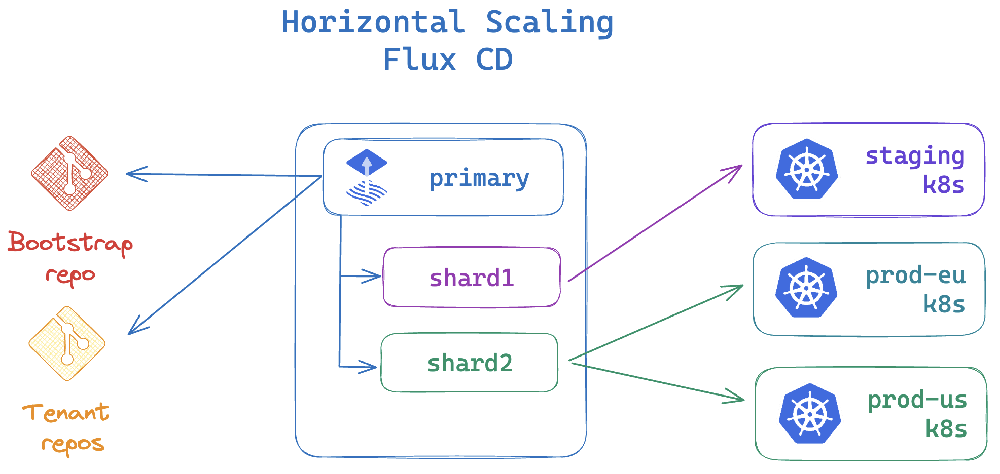

# Flux Architecture

In this guide we will explore the architecture of **Flux CD**, and we will compare the deployment strategies
of the Flux components when implementing GitOps for multi-cluster continuous delivery.

## Flux components

Flux is powered by the [GitOps Toolkit](https://fluxcd.io/flux/components/), a set of
composable APIs and specialized tools that enable a wide range of continuous delivery
use-cases, from simple Kubernetes deployment pipelines to multi-tenant/multi-env
progressive delivery rollouts.

The Flux project is made out of the following components:

<div class="grid cards" markdown>

-   :octicons-command-palette-24:{ .lg .middle } __Flux CLI__

    ---
    A command-line tool for installing, upgrading, operating, monitoring and debugging the Flux controllers running on Kubernetes clusters.

-   :octicons-log-24:{ .lg .middle } __Flux Terraform Provider__

    ---
    An infrastructure-as-code provider for bootstrapping Flux with Terraform and OpenTofu.

-   :octicons-file-code-24:{ .lg .middle } __Flux APIs__

    ---
    A set of Kubernetes CRDs that allow defining continuous delivery workflows in a declarative manner.

-   :octicons-cpu-24:{ .lg .middle } __Flux controllers__

    ---
    A set of Kubernetes controllers that automate all aspects of continuous delivery based on the declarative workflows defined with the Flux APIs.

</div>

## Flux controllers

<div class="grid cards" markdown>
-   :octicons-cpu-24:{ .lg .middle } __source-controller__

    ---
    A controller specialised in artifacts acquisition from external sources such as Git, OCI, Helm repositories and S3-compatible buckets.

-   :octicons-cpu-24:{ .lg .middle } __kustomize-controller__

    ---
    A controller specialized in running continuous delivery pipelines for infrastructure and workloads defined with Kubernetes manifests and assembled with Kustomize.

-   :octicons-cpu-24:{ .lg .middle } __helm-controller__

    ---
    A controller specialized in managing the lifecycle of applications packaged as Helm charts.

-   :octicons-cpu-24:{ .lg .middle } __notification-controller__

    ---
    A controller specialized in sending and receiving continuous delivery events to/from external services.

-   :octicons-cpu-24:{ .lg .middle } __image-reflector-controller__

    ---
    A controller specialized in scanning container registries for new image versions and OCI artifacts revisions.

-   :octicons-cpu-24:{ .lg .middle } __image-automation-controller__

    ---
    A controller specialized in automating the update of container images and OCI artifacts to Git.

</div>

Unlike most CI/CD systems, Flux does not rely on 3rd-party tools to perform its operations
and can't be used to execute arbitrary scripts or commands in the cluster.
From a security perspective, Flux execution is limited to the operations defined in the
Flux APIs and the controllers are designed for multi-tenancy, using Kubernetes impersonation
when deploying applications on behalf of tenants.

To extend Flux beyond its built-in functions, custom controllers can be developed using the
[Flux controller SDK](https://github.com/fluxcd/pkg/tree/main/runtime).
For example, [tofu-controller](https://github.com/flux-iac/tofu-controller)
is a Flux controller for reconciling Terraform and OpenTofu modules.

## Flux bootstrap

Bootstrap is the process of deploying the Flux controllers on a Kubernetes cluster
and configuring them to watch a Git repository for changes. The bootstrap repository
can contain references to other Git repos, OCI repos, Helm charts, S3-compatible buckets;
together all these sources form the desired state of the cluster. 

With Flux running on the cluster, all changes to the desired state are automatically
reconciled, including the self-update of the Flux controllers. If the cluster state
drifts from the desired state, Flux will automatically correct it, effectively
undoing any changes made to the cluster outside of the GitOps workflow.


A bootstrap repository can serve multiple clusters & tenants, and can contain
delivery pipelines that span across multiple environments.
A typical repository structure used by platform teams to manage multiple
clusters and tenants looks like this:

```sh
├── clusters
│   ├── prod1
│   ├── prod2
│   ├── staging
├── infrastructure
│   ├── base
│   ├── production
│   └── staging
└── tenants
    ├── team1
    └── team2
```

The platform team can segregate the clusters add-ons from the tenants' applications.
The cluster add-ons defined in the infrastructure directory, such as admission controllers,
ingress, monitoring, logging, security policies, etc. are deployed by Flux under the
cluster admin role. The platform team can define the reconciliation order and dependencies
between the infrastructure components and the tenants' applications using the Flux `dependsOn`
feature.

The applications deployed on the clusters as Helm releases can be managed by various dev
teams in their own repositories. The platform team can reference these repositories in the
bootstrap repo and apply policies that enforce security, compliance, and best practices.

## Flux multi-cluster deployment strategies

When managing a fleet of Kubernetes clusters with Flux, the platform team can
choose between two deployment strategies:


<div class="grid cards" markdown>

-   :octicons-issue-opened-24:{ .lg .middle } __Standalone__

    ---
    Flux is bootstrapped on each Kubernetes cluster.

-   :octicons-issue-reopened-24:{ .lg .middle } __Hub and Spoke__

    ---
    Flux is bootstrapped on a central cluster, acting as a GitOps hub.

</div>

### Standalone

In the standalone mode, each Kubernetes cluster runs its own Flux controllers.
This mode is suitable for most use-cases, where the clusters are reconciled independently,
from the same or different bootstrap repositories.


**Pros**:

- Reduced attack surface, the API server of each cluster doesn't need to be exposed to external systems.
- Reduced blast radius, each cluster is self-sufficient and can operate independently.
- Suitable for hard multi-tenancy and air-gapped environments where clusters can't communicate with each other.

**Cons**:

- Operational overhead, each cluster needs to be bootstrapped with Flux separately.
- Maintenance overhead, each Flux instance needs to be updated independently.
- Monitoring and observability overhead, each Flux instance needs to be monitored separately, the collected metrics and events need to be aggregated.

To improve the observability of standalone instances, the platform team can
configure the Flux notification-controller on each cluster to send all the
continuous delivery events to a [central alerting system](https://fluxcd.io/flux/monitoring/alerts/).

To reduce the operational overhead, the platform team can integrate the
[Flux Terraform provider](https://github.com/fluxcd/terraform-provider-flux)
with the cluster provisioning process, ensuring that each cluster is bootstrapped with Flux
as part of the cluster creation workflow.

To reduce the maintenance burden of standalone instances,
the platform team can automate the Flux self-update process
using [GitHub Actions](https://fluxcd.io/flux/flux-gh-action/#automate-flux-updates)
or [Renovate bot](https://docs.renovatebot.com/modules/manager/flux/).

In standalone mode, the Git server hosting the bootstrap repository is a Single point of failure (SPOF). 
The SPOF is mitigated by Flux source-controller which maintains a local cache of all
external sources and can ensure that the cluster state drift detection and correction
can continue even if the Git server suffers an outage.

For more information on how to configure Flux for standalone mode, see the
[flux2-kustomize-helm-example](https://github.com/fluxcd/flux2-kustomize-helm-example)
and the [flux2-multi-tenancy](https://github.com/fluxcd/flux2-multi-tenancy) repositories.

### Hub and Spoke

In the Hub and Spoke mode, a central cluster acts as a GitOps hub, managing the
continuous delivery for multiple Kubernetes clusters. The hub cluster
runs the Flux controllers from where it reconciles the spoke clusters
by connecting to their Kubernetes API servers.


**Pros**:

- Reduced operational and maintenance overhead, bootstrapping and updating Flux is done once on the hub cluster.
- Single pane of glass, the platform team can monitor and observe the continuous delivery for all clusters using the Flux metrics and events from the hub instance.
- Suitable when clusters are provisioned with [Kubernetes Cluster API](https://cluster-api.sigs.k8s.io/), where the hub cluster acts as a management cluster.

**Cons**:

- Single point of failure, the hub cluster is a SPOF for the continuous delivery for all clusters.
- Security concerns, if the hub cluster is compromised the attacker can gain access to all spoke clusters.
- Operational complexity, the platform team needs to manage the network connectivity between the hub and spoke clusters API servers.

For more information on how to configure Flux for Hub and Spoke mode, see the
[flux2-hub-spoke-example](https://github.com/fluxcd/flux2-hub-spoke-example) repository.

### Hub sharding and horizontal scaling

When managing a large number of spoke clusters, the hub cluster can be sharded
to distribute the reconciliation load across multiple Flux instances.



The primary Flux instance is responsible for deploying the Flux shard instances
on the hub cluster and for distributing the reconciliation tasks across the shards.
The bootstrap repository contains the sharding configuration, allowing the platform team
to define the shard-to-cluster mapping and the reconciliation order in a declarative manner.

For more information on how to assign Flux instances to specific clusters,
see the [Flux sharding and horizontal scaling guide](https://fluxcd.io/flux/installation/configuration/sharding/).

## Conclusions

Running Flux in the [standalone](#standalone) mode offers a higher degree of security
and autonomy for the clusters at the expense of operational overhead when it comes to
bootstrapping and monitoring the Flux instances.

The [hub and spoke](#hub-and-spoke) mode reduces the operational and maintenance overhead
by centralizing the continuous delivery tooling on a single cluster, but introduces a single
point of failure and networking complexity that can be challenging from a security perspective.

In the standalone mode, Flux [vertical scaling](https://fluxcd.io/flux/installation/configuration/vertical-scaling/)
would suffice to handle the reconciliation load of thousands of applications,
while in the hub and spoke mode, Flux [horizontal scaling](https://fluxcd.io/flux/installation/configuration/sharding/)
is required due to the increased latency and network overhead when managing a large number of clusters.

Depending on the size and security constrains of the Kubernetes fleet, the platform team can choose
a mix of standalone and hub-spoke modes. For example, using a hub cluster for managing
the dev & ephemeral test environments and standalone instances for the production clusters.

